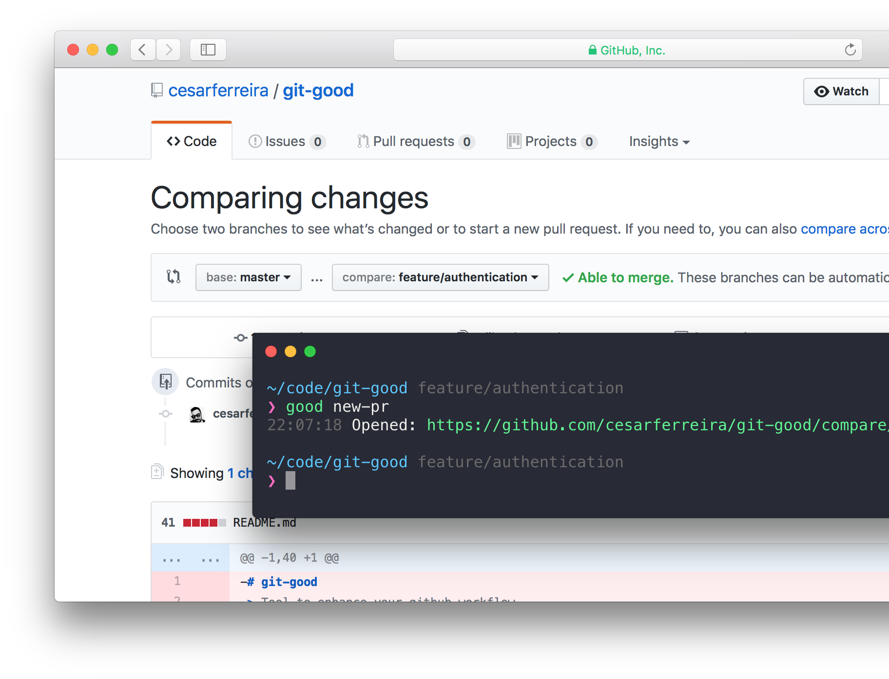

# git-good
> Tool to enhance your github workflow

<p align="center">
  
</p>

[](https://travis-ci.org/cesarferreira/git-good)
[](https://www.npmjs.com/package/git-good)
[](https://www.npmjs.com/package/git-good)

## Install

```sh
npm install --global git-good
# or
yarn global add git-good
```

## Usage

**Highlights:**

- **`$ good pr`**: 
	- when you're in a project with dozens of `pull requests` it's tiresome to go to github and find which one is yours to check if something new is up, this will find the pull request number in which your current branch and open the page for you. 
- **`$ good new-pr`**: 
	- it's a tedious job to go to github, create new `pull request` and find the branch you've been working on and compare it to `develop`, this will automate it for you based on the branch you're currently on.

```
$ good <command>

 Examples
   $ good pr             # opens current pull request page
   $ good new-pr         # opens new pull request page
   $ good prs            # opens pull requests page
   $ good open           # opens repo page
   $ good issues         # opens issues page
   $ good branches       # opens branches page   
   $ good releases       # opens releases page
   $ good wiki           # opens wiki page
   $ good settings       # opens settings page
   $ good contributors   # opens contributors page
```

## Acessing private repositories
If you want to access private repositories all you need to do is to create a **Personal API token** (instructions [here](https://github.com/blog/1509-personal-api-tokens))

Once you got it just export it in your bash/zsh/fish profile.

``` bash
export GIT_GOOD=<your-token-here>
```

## Created by
[Cesar Ferreira](https://cesarferreira.com)

## License
MIT © [Cesar Ferreira](http://cesarferreira.com)
